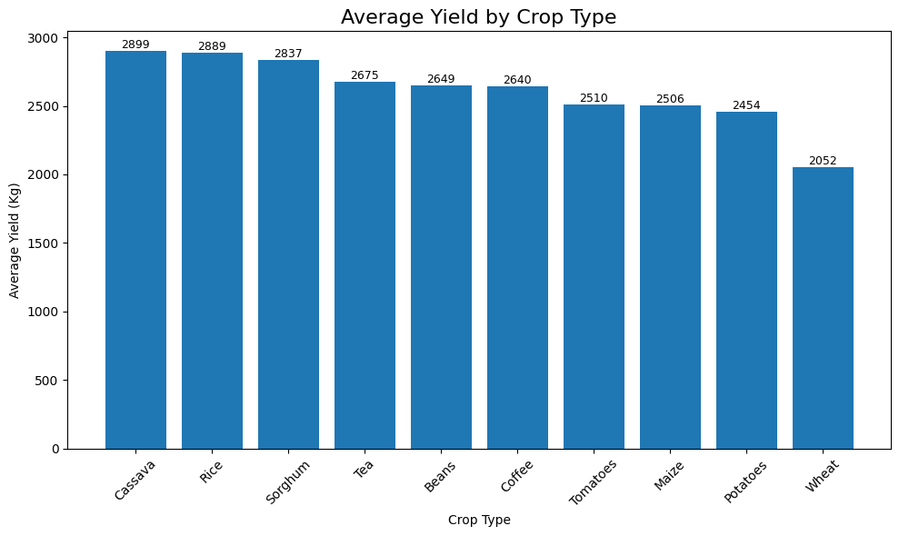
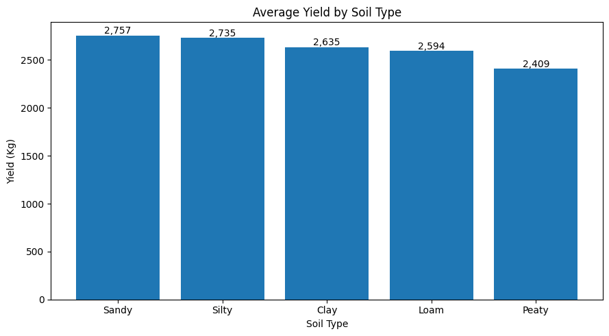
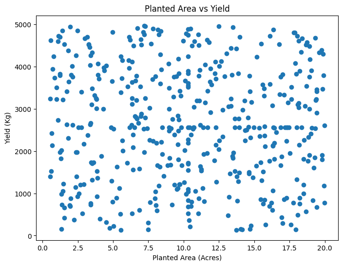
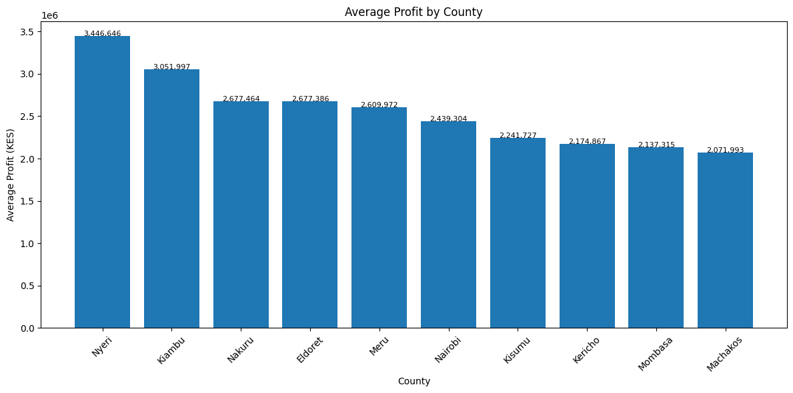
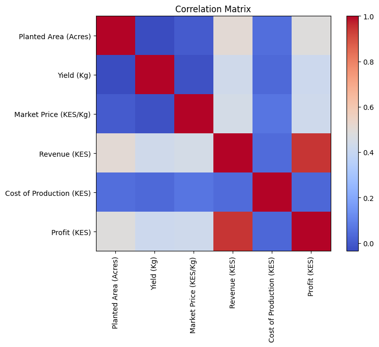

# Kenya Crop Production Analysis

## Project Overview

This project analyzes agricultural data from different crops grown in Kenya to explore patterns in yield, revenue, and profitability.

The aim is to understand how crop type, weather conditions, and farming factors influence agricultural performance.

## Objectives

- Analyze crop production trends in Kenya
- Compare yield performance across different crops
- Explore factors affecting revenue and profit
- Generate insights from agricultural data using Python

## Dataset

The dataset contains information about different crops grown in Kenya, including:

- Crop type
- Farm characteristics
- Planting and harvest dates
- Yield
- Revenue
- Profit
- Weather impact

## Data Analysis Process

The project includes:

- Data cleaning
- Handling missing values
- Data type conversion
- Exploratory Data Analysis (EDA)
- Descriptive statistics
- Data visualization
- Insight generation

## Tools Used

- Python
- Google Colab
- Pandas
- NumPy
- Matplotlib
- Seaborn

## Key Insight

Among the analyzed crops, cassava recorded the highest yield, highlighting differences in crop performance under varying farming conditions.

## Visual Insights

### Crop Yield Comparison
#### average yield by crop type

#### average yield by season

#### average yield by soil type

#### planted area vs yield

### Profit Analysis
#### profit by irrigation

#### prifit by county

## correlation matrix

## Key Insights

#####The analysis revealed several patterns in Kenya's crop production data:

- Cassava recorded the highest yield among the analyzed crops.
- Crop profitability varies significantly across different crop types.
- Weather conditions have an impact on production outcomes.
- Revenue and profit are influenced by multiple agricultural factors.
- Correlation analysis helped identify relationships between numerical variables.

## Author
Justine Barasa
